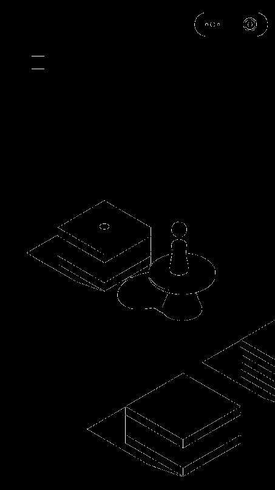

# 微信跳一跳辅助脚本


## 需求：
* python3

        numpy
        opencv-python
* ADB

## 原理：
1. ADB 截图，pull到PC   
2. 图像处理

        1. Canny算子边缘检测
                
      <figure >
                     
      </figure>
        
        2. 边缘图像和棋子图像进行卷积，找到棋子的位置
        
      <figure >
            
            
            
      </figure>
      
        3. 利用边缘图像识别棋盘中间点
3. 计算按压时间 

## 参数调节：
```shell
swipe_time = max(math.pow(distance, 0.85) * 3.60, 300)
```

## 测试模式：
读取```./jump```目录下的图片，在```./test```目录下生成标注过起点终点的图片。注释或删除```t.start()```即可。
```shell
if __name__ == '__main__':
    t = Tiaoyitiao()
    t.start()
    t.test()
```
## 版本说明:
目前只在分辨率为1920*1080的设备测试过


